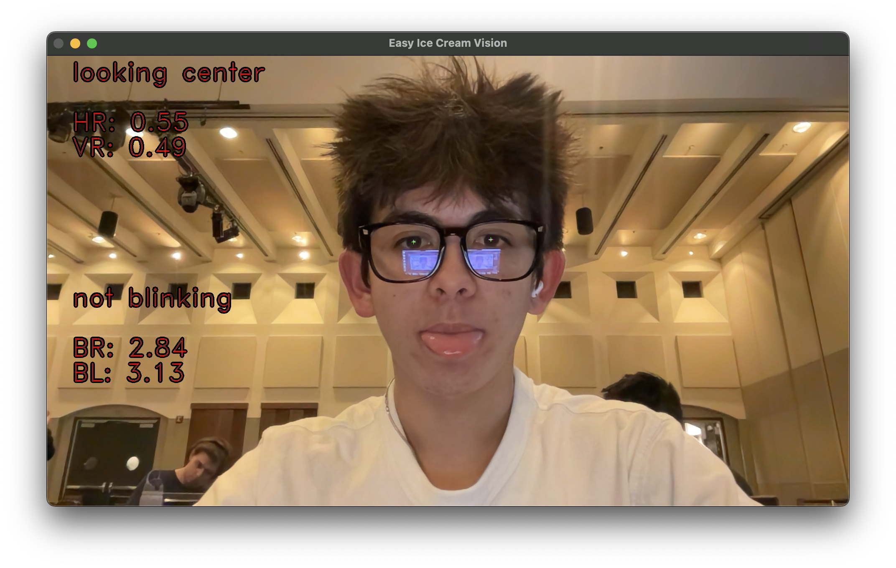
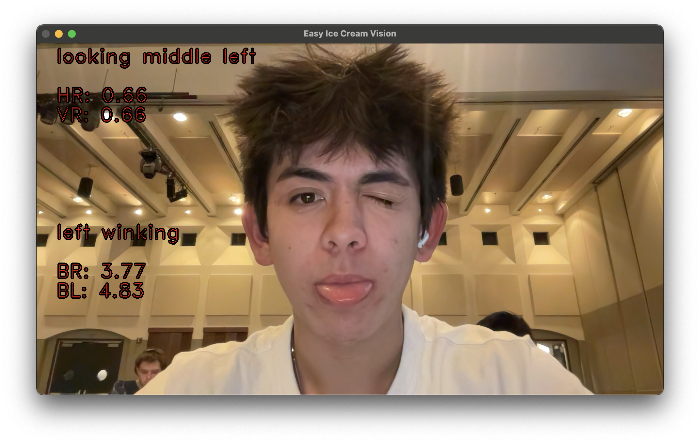

# Easy Ice Cream Vision

*Submitted for Hack on the Hill (HOTH) XII on March 3rd, 2025, hosted by ACM Hack at UCLA.*

Easy Ice Cream Vision is a desktop application that allows the user to control their cursor entirely with their eyes.


> Note that the webcam recording is *mirrored*, so it looks as though the cursor is going in the reverse direction of my eyes.


This project uses and modifies [Antoine Lamé's gaze tracking library](https://github.com/antoinelame/GazeTracking?tab=readme-ov-file). See his repository for more information!

## Installation
### Clone this project

```
git clone https://github.com/lkross06/Easy_Ice_Cream_Vision.git
```

### Install dependencies

Note that the **dlib** library requires separate installation. See [here](https://pyimagesearch.com/2017/03/27/how-to-install-dlib/) for more information.

```
pip3 install -r requirements.txt
```

## Usage

Run the application with

```
python3 app.py
```

Make sure you are in good lighting and not wearing any face or eye equipment! The application will open a window mirroring the webcam's video. 




> Labels with information about your eyes and pupils will appear once your pupils are captured by the software.

- Look in any direction *with your eyes only* to **move the cursor** in that direction.

- Blink for more than two seconds to emulate a **cursor click**.

- Close either eye (wink) for more than two seconds to emulate a **cursor press**. The cursor will release once you open your eyes.

You may press **Q** to quit at any time.